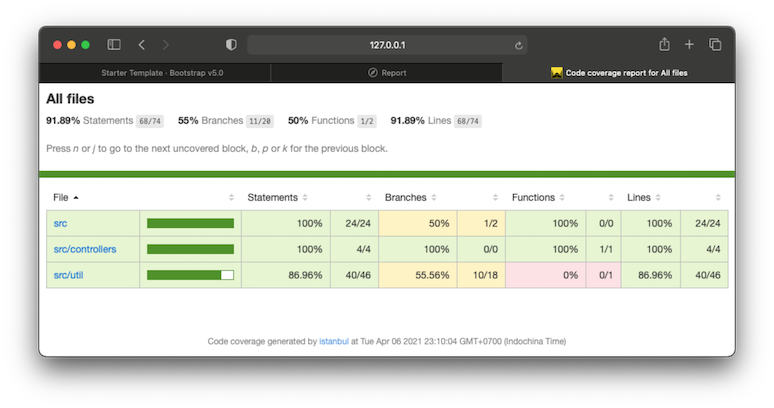

# nodejs-starters

A collection of Node.js starters to get started with a modern web application development. It supports the new **V8 JavaScript Runtime** and it enables to write code using either the **TypeScript** or the modern **ECMAScript 2021** syntax and more.

## Tools and Utilities

The default Starter Kit is with following recommended tools and utilities:

-  [Node.js](https://nodejs.org/en/) JavaScript runtime
-  [ExpressJS](https://expressjs.com/) Node.js web application framework
-  [TypeScript](https://www.typescriptlang.org/) open-source language supporting OOP
-  [ESLint](https://eslint.org/) JavaScript Linter
-  [Airbnb](https://github.com/airbnb/javascript) style guide
-  [Prettier](https://prettier.io/docs/en/integrating-with-linters.html) code formatter
-  [Babel](https://babeljs.io/blog/2020/07/13/the-state-of-babel-eslint) JavaScript compiler
-  [pino](https://github.com/pinojs/pino) for logging
-  [dotenv](https://www.npmjs.com/package/dotenv) for environment variables
-  [cross-env](https://github.com/kentcdodds/cross-env) to manage env variables across OS
-  [Bootstrap](https://getbootstrap.com/) front-end framework
-  [Eta](https://eta.js.org/) template engine
-  [Nodemon](https://nodemon.io/) tool to restart node app automatically
-  [Browsersync](https://browsersync.io/) tool to synchronize browsers
-  [Jest](https://jestjs.io/) JavaScript Testing Framework
-  [SuperTest](https://github.com/visionmedia/supertest) for testing HTTP
-  [Connect MongoDB Session](https://github.com/mongodb-js/connect-mongodb-session#readme) to store Express app sessions in MongoDB

## Getting Started

**1.** Clone the repository and install npm dependencies and utilities:

```bash
# Clone to initialize a new project
% git clone https://github.com/votungphan/nodejs-starters.git new_node_express_app
% cd new_node_express_app
# Remove the git remote
% rm -rf .git
# Install dependencies and utilities
% npm install
```

**2.** Create a GitHub repository for your new_node_express_app project:

Follow the [GitHub Getting started Guide](https://docs.github.com/en/github/getting-started-with-github/create-a-repo) to create a new GitHub repository for your new_node_express_app and add the URL for the remote repository where your local repository will be pushed.

```bash
% git remote add origin https://github.com/<Your-GitHub>/<Your-Project-Repository>.git
# Use the command to verify the remote URL of your project
% git remote -v
```

**3.** Execute the built-in script to load a sample page of the Starter:

Generic scripts are configured in the **[package.json](./package.json)** file. However, you might customize for your style or your specific demand.

```json
"scripts": {
   "clean": "rm -rf dist/** reports/**",
   "eslint": "npx eslint '**/*.{js,jsx,ts,tsx}'",
   "eslint:fix": "npx eslint '**/*.{js,jsx,ts,tsx}' --fix",
   "test:jest": "npx jest --forceExit --coverage --verbose",
   "watch:jest": "npx jest --forceExit --coverage --verbose --watch",
   "build:tsc": "npx tsc",
   "watch:ts": "npx cross-env SAFE_ENV=true nodemon --config src/config/nodemon.json --inspect src/server.ts",
   "watch:js": "npm run build:tsc && npx cross-env SAFE_ENV=true nodemon --config src/config/nodemon.json --inspect dist/server.js",
   "server:ts": "npx cross-env SAFE_ENV=true ts-node src/server.ts",
   "server:js": "npm run build:tsc && npx cross-env SAFE_ENV=true node dist/server.js"
},
```

```bash
# Execute following command to load the starter
% npm run watch:ts
```

The following Home page is built with the **[Eta template engine](https://eta.js.org/)** from the **[Bootstrap v5.0](https://getbootstrap.com/docs/5.0/getting-started/download/)** starter template: 

## Project Directory Structure

There are many great recommendations out there and you can select one of them for your project. The Starter kit follows the **[MVC Design Pattern](https://en.wikipedia.org/wiki/Model%E2%80%93view%E2%80%93controller)** for developing the web application.

```bash
% tree ./
dist/ # Output folder of the transpiler
test/ # Testing source code
├── jest/
│   └── home.test.ts
src/  # Application source code and data
├── config/
│   └── nodemon.json
├── controllers/
│   └── home.ts
├── util/
│   ├── logger.ts
│   ├── secrets.ts
│   └── session.ts
├── views/
│   ├── home/
│   │   ├── home.css
│   │   └── home.eta
│   └── partials/
│       ├── footer.eta
│       ├── head.eta
│       ├── header.eta
│       └── layout.eta
├── app.ts
└── server.ts
```

## Jest Testing

Jest testing is integrated with following great reporters:

-  [jest-junit](https://github.com/jest-community/jest-junit)
-  [jest-html-reports](https://github.com/Hazyzh/jest-html-reporters)
-  [jest-stare](https://github.com/dkelosky/jest-stare)

Following is an example to generate a failed report because of missing to specify required environment variables:

```bash
# This script is without cross-env SAFE_ENV=true specified
% npm run test:jest
```


Following is an example to generate a passed report with a simple fixing by specifying the required environment variables:

```bash
% npx run cross-env SAFE_ENV=true jest --forceExit --coverage --verbose
```


You can find other reports under the **[reports/](./reports/)** folder such as the Coverage report from **Jest-Stare** HTML report (**reports/jest-stare/index.html**) as below:



## Development Guide

In order to customize the Starter kit to support your specific needs, you might find more details from the **[Step-by-Step Guide](https://github.com/votungphan/nodejs-starters/wiki)** of this Node.js Web Application Starter kit.

## Todo List

Following is a list of items that I would like to support in the short term whenever I have free time:

-  [Webpack](https://webpack.js.org/) integration for the application bundler
-  [Redis](https://github.com/redis/redis) integration for caching the application
-  [Husky](https://github.com/typicode/husky) integration for the pre-commit hook for the application
-  [Mocha](https://mochajs.org/) integration to leverage the application testing
-  More flavors of the Node.js starter for getting started with other applications such as the **[Google Apps Script](https://developers.google.com/apps-script)** application and the **[NestJS](https://nestjs.com/)** application

## Issues and Enhancements

Feel free to use or to customize this starter kit for your suite and I'm very appreciate any kind of support to improve this starter kit for being able to help shortening the education to the real world of the web application development. Please provide your feedbacks through <https://github.com/votungphan/nodejs-starters/issues>

## License and Copyright

-  **MIT License @2021 Phan Vo**
